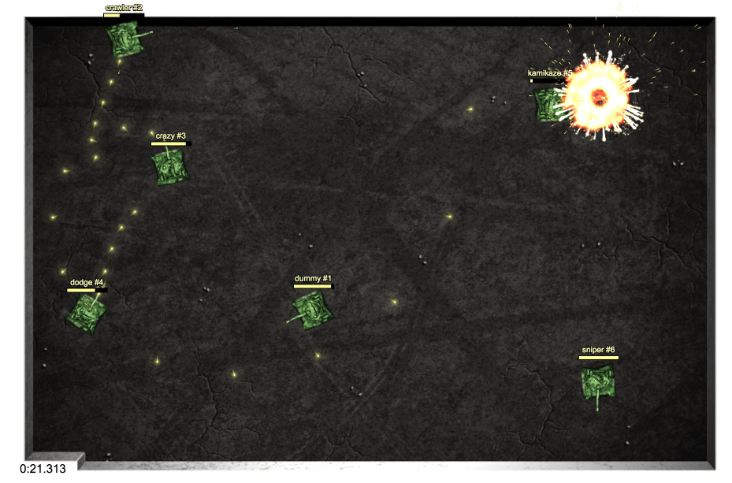

# JsBattle - JavaScript Programming Game

## About
JsBattle is inspired by [Robocode](http://robocode.sourceforge.net/). It is a game for JavaScript developers. The goal is to program artificial intelligence of a tank that will destroy all opponents and win the competition.

## Documentation
Read more in [/packages/jsbattle](./packages/jsbattle/README.md)

## How to start
上面Documentation中的原版How to start中的教程中有一些问题于是我稍稍修改一下

### Demo
可以在web页面中打开jsbattle的试玩网页： [http://jsbattle.jmrlab.com](http://jsbattle.jmrlab.com)

### Installation
在文件根目录使用NPM进行安装：
    
    npm install jsbattle
    
命令行cd进入文件目录node_modules/jsbattle中开始运行JsBattle

        npm run start
        
然后在浏览器中打开： [http://localhost:8080](http://localhost:8080)

原版中运行程序时可能会出现

    λ  npm start
    
    > jsbattle@2.5.0 start F:\jsbattle\node_modules\jsbattle
    > ./dist/jsbattle.js start ...
    
    '.' 不是内部或外部命令，也不是可运行的程序
    npm ERR! code ELIFECYCLE
    npm ERR! errno 1
    npm ERR! jsbattle@2.5.0 start: `./dist/jsbattle.js start ...`
    npm ERR! Exit status 1
    npm ERR!
    npm ERR! Failed at the jsbattle@2.5.0 start script.
    npm ERR! This is probably not a problem with npm. There is likely additional logging output above.
    
    npm ERR! A complete log of this run can be found in:
    npm ERR!     C:\Users\Administrator\AppData\Roaming\npm-cache\_logs\2019-09-27T06_11_26_919Z-debug.log
    
上面的报错导致程序没有正常打开，经过亲手找错后发现是在./jsbattle/package.json文件中的start脚本中
出错了(坑了我两天)，原文件中为：
      
      "scripts": {
        "start": "./dist/jsbattle.js start ...",
        "clean": "rimraf dist",
        "build": "npm run build:server && npm run build:webpage",
        "build:webpage": "cpx './node_modules/jsbattle-webpage/dist/**/*' ./dist/public",
        "build:server": "cpx './src/**/*' ./dist"
      },
      
在start中有错误，应改为：

    "scripts": {
            "start": "node ./dist/jsbattle.js start ...",
            "clean": "rimraf dist",
            "build": "npm run build:server && npm run build:webpage",
            "build:webpage": "cpx './node_modules/jsbattle-webpage/dist/**/*' ./dist/public",
            "build:server": "cpx './src/**/*' ./dist"
          },

## How to play?

部分入门文档的位置：

- 演示网站： [http://jsbattle.jmrlab.com/docs](http://jsbattle.jmrlab.com/docs)
- 本地运行： [http://localhost:8080/docs](http://localhost:8080/docs)
-  GitHub： [/packages/jsbattle-docs/docs](/packages/jsbattle-docs/docs)
